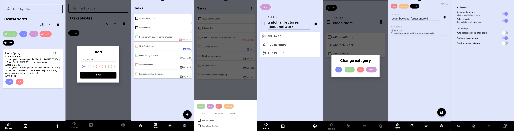

# Note&Task
App for storing notes and managing tasks

## :spiral_notepad: Features
- [X] Create, update, delete tasks, notes and categories
- [X] Link task and note to categories to filter and sort them
- [X] Filter ans sort tasks and notes by categories and etc
- [X] Search tasks and notes

## :paperclip: Architecture

## :hammer_and_pick: Tech stack
- Kotlin
- XML + ViewBinding
- Kotlin Coroutines + Flow
- Hilt (DI)
- Jetpack Navigation + SafeArgs
- Room (SQLite ORM)
- DataStore
- WorkManager

## :sparkles: Screenshots

