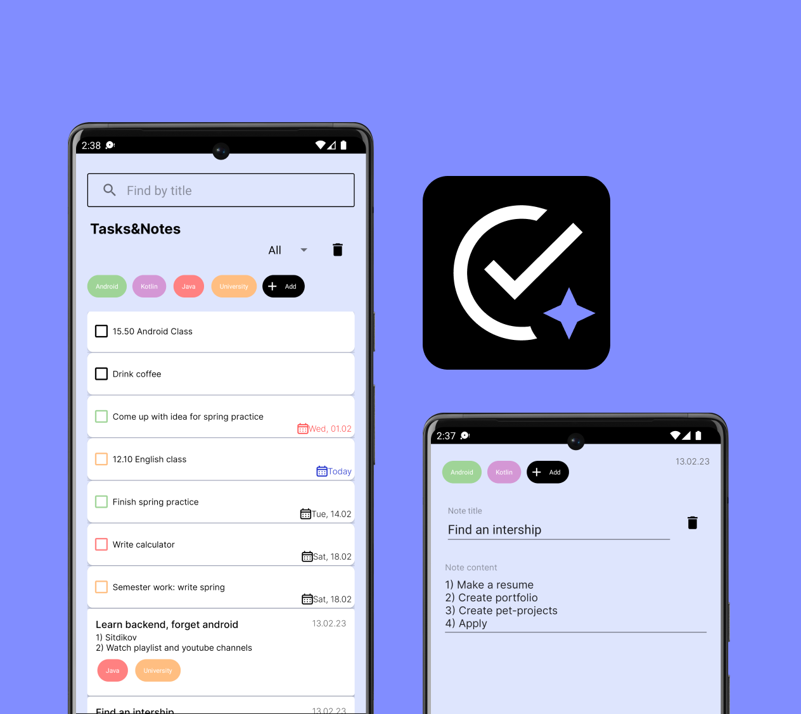
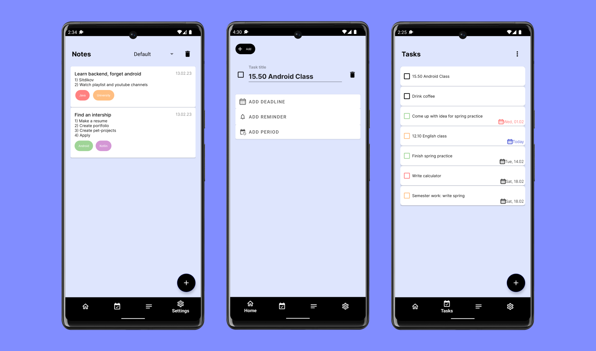
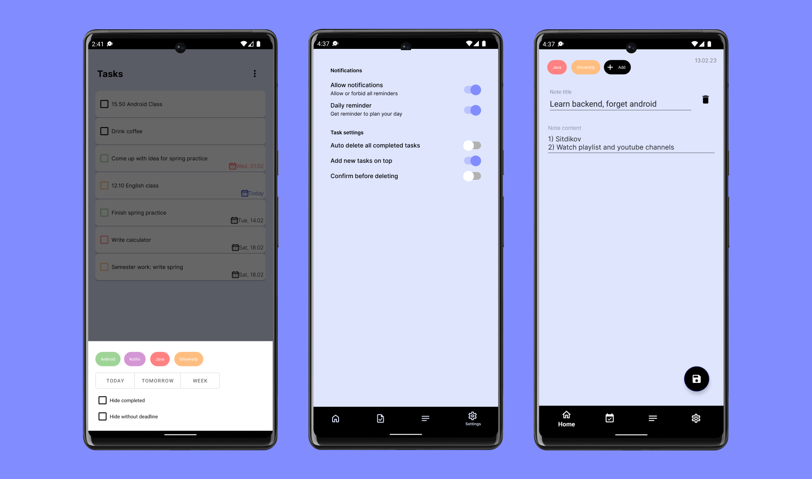

# NoteApp: app for storing notes and managing tasks

## Features

[X] Create, update, delete tasks, notes and categories
[X] Link task and note to categories to filter and sort them
[X] Filter ans sort tasks and notes by categories and etc
[X] Search tasks and notes
[-] Set reminder, periodicity and deadline date for task
[-] Customize settings

## Tech stack

### Core

- Kotlin
- XML + ViewBinding
- Kotlin Coroutines + Flow
- Hilt (DI)
- Jetpack Navigation + SafeArgs

### Local Persistence

- Room (SQLite ORM)
- DataStore

### Others

- WorkManager

## Screenshots

